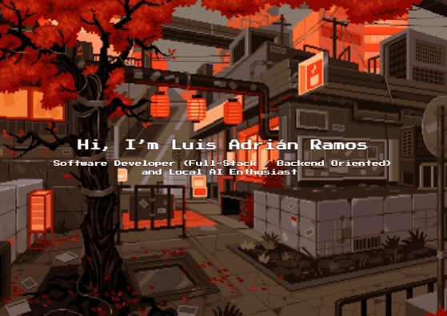

  

  <h1>Hi ✌️, Luis Adrián</h1>
  
<strong>Software Developer (Full-Stack / Backend Oriented) | Local AI </strong>

---

### 👾 About Me

- 🔭 **I’m currently working on:** Backend architecture, scalable REST APIs, and local AI workflows.
- 🧠 **Research & Local AI:** Exploring quantization techniques (GGUF/EXL2), hardware optimization, and low-level model inference.
- 👯 **I’m looking to collaborate on:** Open-source backend tooling, Python/Django projects, or AI inference tools.
- 🤝 **I’m looking for help with:** Advanced quantization workflows and GPU/compute tuning.
- 🌱 **I’m currently learning:** Low-level inference engines, advanced caching strategies, and system profiling.
- 💬 **Ask me about:** Python, Django, SQL/NoSQL databases, Linux environments, and local LLMs.
- ⚡ **Fun fact:** I spend as much time optimizing my Linux setup and hardware configs as I do writing code.

---

  

---

  
  

**Lenguajes de Sistema, Entornos & DevOps**  

**IA, Machine Learning & Data**  

---

  

### 🎮 Más Allá del Código
- 🏔️ **Montaña & Trekking:** Rutas al aire libre y desconexión en altura.
- 🕹️ **Gaming & Modding:** Títulos inmersivos, entornos interactivos y mecánicas complejas.
- 🖥️ **Hardware Lab:** Banco de pruebas para benchmarks, tuning de kernels y optimización de recursos.

  <a href="https://open.spotify.com">
    <!-- Requiere desplegar la instancia de novatorem/spotify-readme en Vercel -->
    
  </a>

---

  

### 🛠️ Tech Stack

**Backend & Frameworks**  

**Bases de Datos (SQL & NoSQL)**  

**Frontend, Mobile & UI**  

---

  

